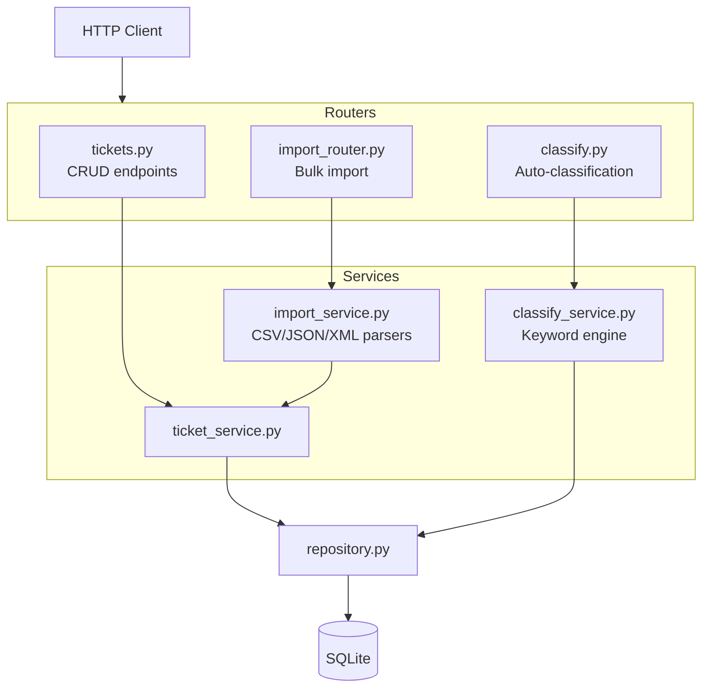

# 🎧 Homework 2: Intelligent Customer Support System

> **Student Name**: Vladyslav Shut
> **Date Submitted**: 2026-05-08
> **AI Tools Used**: Claude Code (Claude Opus 4.6), SpecKit Fleet Orchestrator

---

## 📋 Project Overview

A REST API for customer support ticket management built with **Python/FastAPI**. The system supports multi-format ticket import (CSV, JSON, XML), keyword-based auto-classification with confidence scoring, and comprehensive test coverage.

### Key Features

- 🎫 **Ticket CRUD** — Create, read, update, delete support tickets with full validation
- 📦 **Bulk Import** — Import tickets from CSV, JSON, and XML files with per-record error reporting
- 🤖 **Auto-Classification** — Keyword-based categorization (6 categories) and priority assignment with confidence scores
- 📄 **Pagination & Filtering** — Offset-based pagination with category/priority/status filters
- 🧪 **56 Tests** — 88.49% code coverage across 8 test files
- 📚 **4 Documentation Files** — README, API Reference, Architecture, Testing Guide with 6 Mermaid diagrams

---

## 🛠️ Tech Stack

| Component | Technology |
|-----------|-----------|
| Language | Python 3.11+ |
| Framework | FastAPI + Uvicorn |
| Validation | Pydantic v2 |
| Database | SQLite via aiosqlite |
| XML Parsing | defusedxml (XXE-safe) |
| Testing | pytest + pytest-asyncio + httpx |
| Coverage | pytest-cov (88.49%) |

---

## 🏗️ Architecture



---

## ▶️ How to Run

### Prerequisites

- Python 3.11+

### Setup

```bash
cd homework-2
python3 -m venv venv
source venv/bin/activate  # macOS/Linux
pip install -r requirements.txt
pip install -r requirements-dev.txt
```

### Start the Server

```bash
uvicorn src.main:app --reload --port 8000
```

- API: http://localhost:8000
- Swagger docs: http://localhost:8000/docs

### Quick Test

```bash
# Create a ticket
curl -X POST http://localhost:8000/tickets \
  -H "Content-Type: application/json" \
  -d '{
    "customer_id": "CUST-001",
    "customer_email": "test@example.com",
    "customer_name": "Test User",
    "subject": "Cannot login",
    "description": "Getting error 403 when trying to access my account"
  }'

# List tickets
curl http://localhost:8000/tickets

# Import from CSV
curl -X POST http://localhost:8000/tickets/import \
  -F "file=@tests/fixtures/sample_tickets.csv"

# Auto-classify (replace {id} with actual ticket UUID)
curl -X POST http://localhost:8000/tickets/{id}/auto-classify
```

---

## 🧪 Running Tests

```bash
# Run all tests
pytest

# Run with coverage report
pytest --cov=src --cov-report=html --cov-report=term

# Run specific test file
pytest tests/test_ticket_api.py -v
```

### Test Summary

| Test File | Tests | Category |
|-----------|-------|----------|
| test_ticket_api.py | 11 | API endpoints |
| test_ticket_model.py | 9 | Pydantic validation |
| test_import_csv.py | 6 | CSV parsing |
| test_import_json.py | 5 | JSON parsing |
| test_import_xml.py | 5 | XML parsing |
| test_categorization.py | 10 | Auto-classification |
| test_integration.py | 5 | End-to-end workflows |
| test_performance.py | 5 | Performance benchmarks |
| **Total** | **56** | **88.49% coverage** |

---

## 📁 Project Structure

```
homework-2/
├── src/
│   ├── main.py                  # FastAPI app entry point
│   ├── models/
│   │   ├── enums.py             # Category, Priority, Status enums
│   │   └── ticket.py            # Pydantic request/response models
│   ├── routers/
│   │   ├── tickets.py           # CRUD endpoints
│   │   ├── import_router.py     # Bulk import endpoint
│   │   └── classify.py          # Auto-classification endpoint
│   ├── services/
│   │   ├── ticket_service.py    # Business logic
│   │   ├── import_service.py    # CSV/JSON/XML parsers
│   │   └── classify_service.py  # Keyword classification engine
│   └── db/
│       ├── database.py          # SQLite connection management
│       └── repository.py        # Data access layer
├── tests/
│   ├── conftest.py              # Shared fixtures
│   ├── test_ticket_api.py       # 11 API tests
│   ├── test_ticket_model.py     # 9 validation tests
│   ├── test_import_csv.py       # 6 CSV tests
│   ├── test_import_json.py      # 5 JSON tests
│   ├── test_import_xml.py       # 5 XML tests
│   ├── test_categorization.py   # 10 classification tests
│   ├── test_integration.py      # 5 integration tests
│   ├── test_performance.py      # 5 performance tests
│   └── fixtures/                # Sample data (CSV/JSON/XML)
├── docs/
│   ├── README.md                # Developer guide
│   ├── API_REFERENCE.md         # Full endpoint documentation
│   ├── ARCHITECTURE.md          # Architecture & design decisions
│   └── TESTING_GUIDE.md         # QA testing guide
├── requirements.txt
├── requirements-dev.txt
└── pyproject.toml
```

---

## 🤖 AI Usage

This project was built using **Claude Code** (Claude Opus 4.6) with the **SpecKit Fleet Orchestrator** — a 10-phase workflow that drives features from specification to verified implementation:

1. **Specify** — Generated spec.md with 25 functional requirements
2. **Clarify** — Refined tech stack (FastAPI), pagination, duplicate handling
3. **Plan** — Created architecture plan with layered design
4. **Checklist** — Generated 32 requirement quality checks
5. **Tasks** — Produced 41 implementation tasks with parallel groups
6. **Analyze** — Cross-artifact consistency check (0 CRITICAL issues)
7. **Review** — Skipped (single-model session)
8. **Implement** — Built all source code, tests, fixtures, and docs
9. **Verify** — Post-implementation validation (100% requirement coverage)
10. **Tests** — 56 tests passing, 88.49% coverage

### Context-Model-Prompt Framework

- **Context**: Homework requirements (TASKS.md) + SpecKit design artifacts (spec, plan, data model, contracts)
- **Model**: Claude Opus 4.6 (1M context) for orchestration; Claude Sonnet for parallel implementation tasks
- **Prompt**: SpecKit skills provided structured prompts for each phase, ensuring consistent output quality

---

<div align="center">

*This project was completed as part of the AI-Assisted Development course.*

</div>
