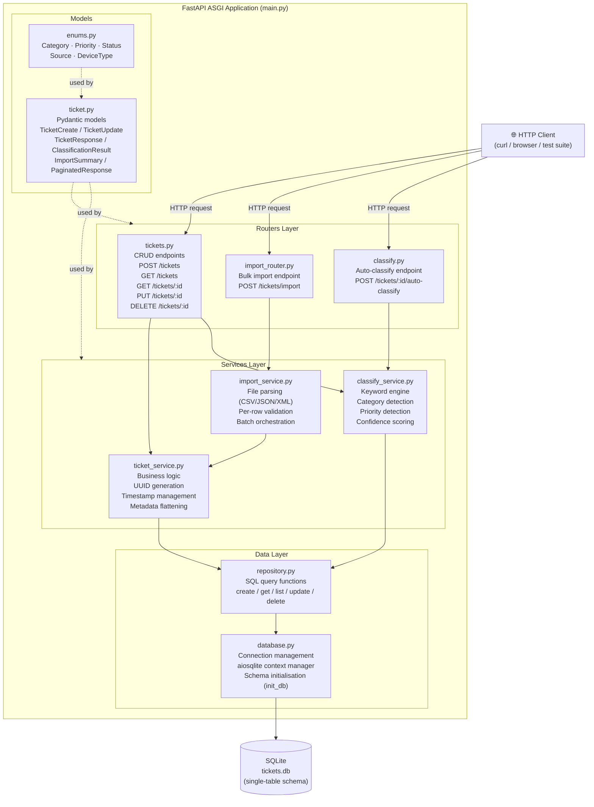
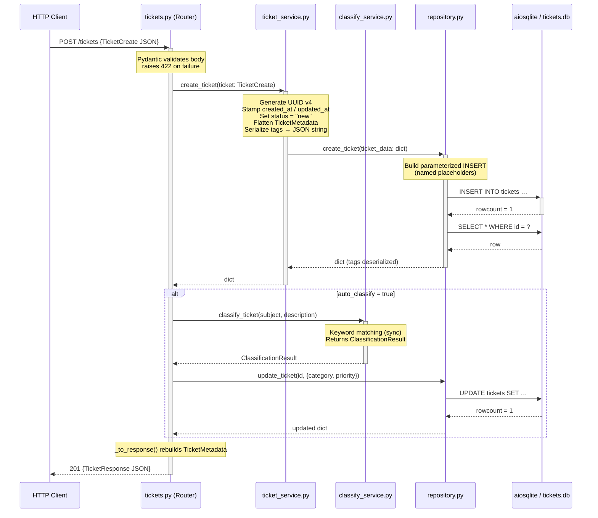
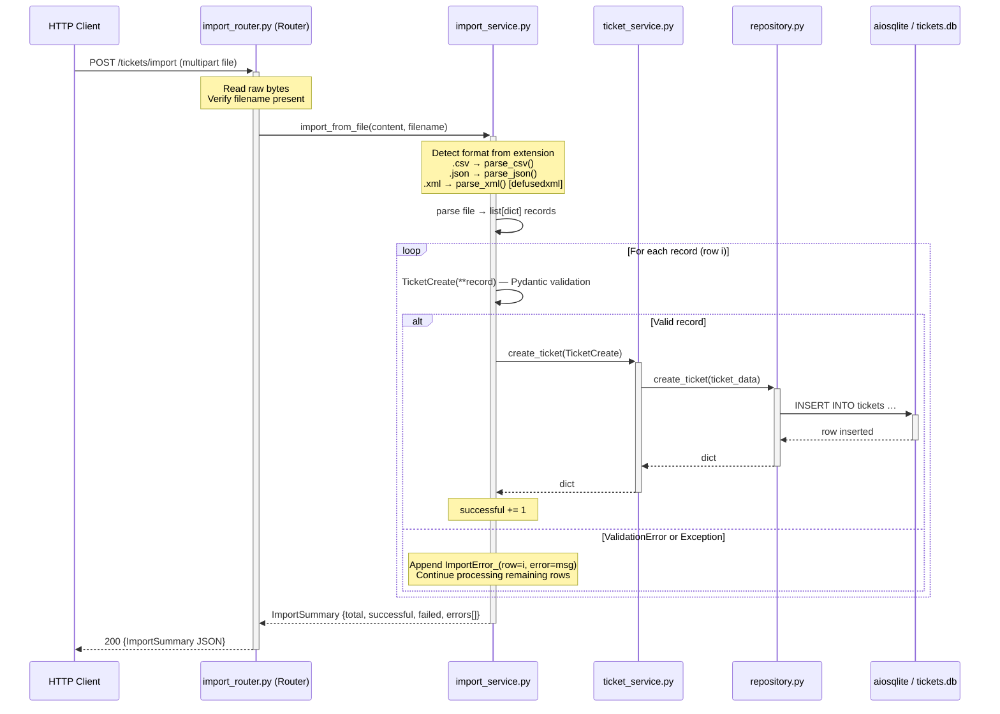
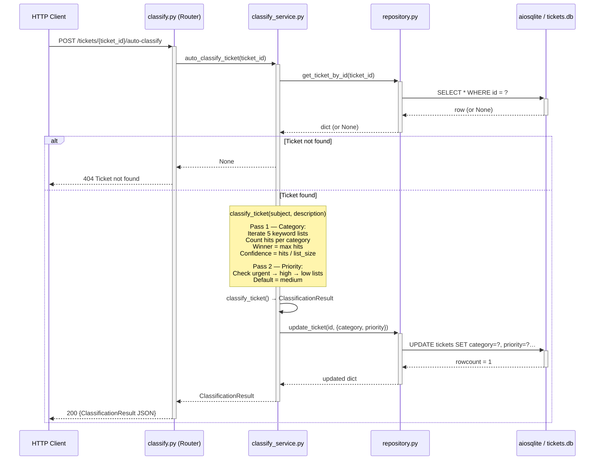

# Architecture Documentation — Customer Support Ticket System

**Audience:** Technical leads and senior engineers
**Last updated:** 2026-05-08
**Stack:** Python 3.11 · FastAPI · aiosqlite · Pydantic v2

---

## Table of Contents

1. [High-Level Architecture](#1-high-level-architecture)
2. [Component Descriptions](#2-component-descriptions)
3. [Data Flow Diagrams](#3-data-flow-diagrams)
4. [Design Decisions and Trade-offs](#4-design-decisions-and-trade-offs)
5. [Security Considerations](#5-security-considerations)
6. [Performance Considerations](#6-performance-considerations)

---

## 1. High-Level Architecture

The system is organized into four strict horizontal layers. Each layer may only communicate downward; no layer reaches upward into its caller.

### Layer summary

| Layer | Responsibility | Key files |
|---|---|---|
| Routers | HTTP boundary — parse requests, call services, shape responses | `tickets.py`, `import_router.py`, `classify.py` |
| Services | Business logic — orchestration, rules, transformations | `ticket_service.py`, `import_service.py`, `classify_service.py` |
| Data | Persistence — SQL queries and connection lifecycle | `repository.py`, `database.py` |
| Models | Schema contracts — validation and serialization | `ticket.py`, `enums.py` |

---

## 2. Component Descriptions

### 2.1 Routers Layer

Routers are thin HTTP adapters. They own no business logic; their only jobs are to validate the incoming HTTP contract (delegated to Pydantic), dispatch to the correct service, and convert service output into HTTP responses (status codes, response models).

#### `routers/tickets.py` — Core CRUD

Exposes the standard REST surface for the `tickets` resource:

| Method | Path | Action |
|---|---|---|
| `POST` | `/tickets` | Create a ticket; if `auto_classify=true`, immediately classifies it |
| `GET` | `/tickets` | List tickets with optional `category`, `priority`, `status` filters + pagination |
| `GET` | `/tickets/{ticket_id}` | Retrieve a single ticket by ID |
| `PUT` | `/tickets/{ticket_id}` | Partial update |
| `DELETE` | `/tickets/{ticket_id}` | Hard delete |

Contains a private `_to_response()` helper that reconstructs the nested `TicketMetadata` object from the flattened DB row before serialisation.

#### `routers/import_router.py` — Bulk Import

Exposes a single multipart endpoint `POST /tickets/import`. Reads the uploaded file as raw bytes, detects format from the filename extension, and delegates entirely to `import_service`. Returns an `ImportSummary` with per-row success/failure detail.

#### `routers/classify.py` — Auto-Classification

Exposes `POST /tickets/{ticket_id}/auto-classify`. Delegates to `classify_service.auto_classify_ticket()`, which fetches the existing ticket, runs keyword matching, persists the result, and returns a `ClassificationResult`.

---

### 2.2 Services Layer

Services contain all business logic. They are async functions that coordinate between models, other services, and the repository. They never import from routers.

#### `services/ticket_service.py` — Business Logic

- Generates a UUID v4 identifier for every new ticket.
- Stamps `created_at` and `updated_at` as UTC ISO-8601 strings.
- Assigns default status `new`.
- Flattens the nested `TicketMetadata` object into top-level fields before sending to the repository (the DB schema is flat; no JSON column for metadata).
- Enforces a hard cap of `page_size ≤ 100` on list queries.
- Serializes `tags` list to a JSON string for storage.

#### `services/import_service.py` — File Parsing and Batch Creation

Supports three formats:

| Format | Parser | Notable behaviour |
|---|---|---|
| CSV | `csv.DictReader` | `metadata_*` columns folded into nested `metadata` dict; `tags` column accepts JSON array or comma-separated string |
| JSON | `json.loads` | Expects a top-level JSON array of objects |
| XML | `defusedxml.ElementTree` | Expects `<tickets><ticket>…</ticket></tickets>` structure; `<tags><tag>` children and `<metadata>` sub-tree handled explicitly |

For each parsed record, the service validates it as a `TicketCreate` Pydantic model. Per-row failures are caught individually and collected into `ImportError_` entries; processing continues for remaining rows (partial-success semantics).

#### `services/classify_service.py` — Keyword Engine

Implements a two-pass classification approach with no external ML dependencies:

1. **Category pass** — iterates over five keyword lists (one per non-`other` category). The category with the most keyword hits wins. Confidence is computed as `hits / keyword_list_length` (capped at 1.0). Falls back to `Category.other` with confidence 0.1 if no keywords match.

2. **Priority pass** — independent keyword lists for `urgent`, `high`, and `low` are checked in order. First match wins; default is `medium`.

Both passes operate on `(subject + " " + description).lower()`, so matching is case-insensitive and cross-field.

---

### 2.3 Data Layer

#### `db/repository.py` — SQL Query Functions

Pure async functions that translate between Python dicts and SQLite rows. Key details:

- All SQL uses named/positional parameters (`?` placeholders) — never string interpolation.
- `row_to_dict()` deserializes the JSON-serialized `tags` column back to a Python list on every read.
- `update_ticket()` builds the `SET` clause dynamically from non-`None` keys, ensuring only supplied fields are overwritten.
- When `status` is changed to `resolved`, a `resolved_at` timestamp is automatically set if one is not already present.

#### `db/database.py` — Connection Management

- `DB_PATH` defaults to `tickets.db`; overridable via the `DATABASE_URL` environment variable.
- `get_db()` is an async context manager that opens and closes an `aiosqlite` connection per call — no connection pool, appropriate for SQLite.
- `init_db()` is called once at application startup via the FastAPI `lifespan` hook; it runs a `CREATE TABLE IF NOT EXISTS` migration.

---

### 2.4 Models

#### `models/ticket.py` — Pydantic Schemas

| Model | Purpose |
|---|---|
| `TicketCreate` | Input validation for new tickets. `EmailStr` on `customer_email`; `Field` constraints on lengths. Optional `auto_classify` flag. |
| `TicketUpdate` | Partial-update payload; all fields optional. |
| `TicketResponse` | Canonical API response; always includes nested `TicketMetadata`. |
| `ClassificationResult` | Returned by the classify endpoint. Includes `confidence` (0–1 float), `reasoning` string, and matched `keywords_found` list. |
| `ImportSummary` | Returned by the import endpoint. Counters plus a list of `ImportError_` objects with row numbers. |
| `PaginatedResponse[T]` | Generic wrapper adding `page`, `page_size`, `total` to any list response. |

#### `models/enums.py` — Constrained Values

All enums inherit from `(str, Enum)` so their values are plain strings in JSON output, and FastAPI can expose them as string literals in OpenAPI without extra configuration.

| Enum | Values |
|---|---|
| `Category` | `account_access`, `technical_issue`, `billing_question`, `feature_request`, `bug_report`, `other` |
| `Priority` | `urgent`, `high`, `medium`, `low` |
| `Status` | `new`, `in_progress`, `waiting_customer`, `resolved`, `closed` |
| `Source` | `web_form`, `email`, `api`, `chat`, `phone` |
| `DeviceType` | `desktop`, `mobile`, `tablet` |

---

## 3. Data Flow Diagrams

### 3.1 Ticket Creation Flow

### 3.2 Bulk Import Flow

### 3.3 Auto-Classification Flow

---

## 4. Design Decisions and Trade-offs

### 4.1 Layered Architecture

**Decision:** Strict four-layer separation (Routers → Services → Repository → DB).

**Benefits:**
- **Separation of concerns** — HTTP knowledge does not leak into business logic; SQL knowledge does not leak into services. Each layer can be read and understood in isolation.
- **Testability** — services can be unit-tested by mocking the repository; the repository can be tested against an in-memory SQLite database without spinning up the full ASGI stack.
- **Replaceability** — swapping SQLite for PostgreSQL requires changes only in `database.py` and `repository.py`; the service layer is unaffected.

**Trade-off:** Adds boilerplate. For a simple CRUD endpoint the additional indirection is verbose, but the consistency benefit outweighs the cost as the codebase grows.

---

### 4.2 SQLite over PostgreSQL

**Decision:** Use SQLite via `aiosqlite` as the sole data store.

**Benefits:**
- Zero infrastructure: no database server to configure, no connection string secrets to manage.
- Suitable for an educational project where data volume and concurrent write throughput are not concerns.
- The `DATABASE_URL` environment variable makes the path swappable without code changes.

**Trade-off:** SQLite does not support concurrent writers; heavy parallel `POST /tickets` traffic will serialize at the file-lock level. Pagination and async I/O mitigate read pressure. See [Section 6](#6-performance-considerations).

---

### 4.3 Keyword-Based Classification over ML

**Decision:** Deterministic keyword matching instead of an LLM or embedding model.

**Benefits:**
- **Deterministic** — identical input always produces identical output; no model drift, no hallucination risk.
- **Testable** — expected classifications are assertable in unit tests without mocking an external API.
- **Zero runtime cost** — no network call, no GPU, no token quota.
- **Transparent** — the `ClassificationResult` exposes `keywords_found` and `reasoning`, making every decision auditable.

**Trade-off:** Low recall on tickets that use unusual phrasing. A ticket saying "my account portal returns HTTP 403" will not match the `account_access` keyword list (`"login"`, `"password"`, etc.). Extending coverage requires updating keyword lists manually.

---

### 4.4 Pydantic v2 for Validation

**Decision:** Use Pydantic v2 models for all request/response schemas.

**Benefits:**
- FastAPI generates an OpenAPI 3.1 schema automatically from Pydantic models, giving Swagger UI and ReDoc for free.
- `EmailStr`, `Field(min_length=…)`, and constrained enums catch malformed input before it reaches the service layer, returning structured 422 responses with field-level error detail.
- `model_dump(exclude_none=True)` and `model_dump(exclude={"metadata"})` provide clean transformation helpers used extensively in the service layer.

**Trade-off:** Pydantic v2's stricter coercion rules (compared to v1) require explicit enum membership; values not in the enum raise validation errors rather than being silently passed through.

---

### 4.5 defusedxml for Safe XML Parsing

**Decision:** Replace the standard library `xml.etree.ElementTree` with `defusedxml.ElementTree` for XML imports.

**Benefits:**
- Guards against the XML External Entity (XXE) attack class, where a malicious document references external files or network resources via entity declarations.
- Drop-in API replacement — no refactoring of the parsing logic.

**Trade-off:** An extra dependency. The standard library parser would be acceptable if XML import were restricted to internal, trusted sources, but since the `/tickets/import` endpoint accepts arbitrary user uploads, the mitigation is warranted.

---

### 4.6 Async Throughout

**Decision:** FastAPI (ASGI) + `aiosqlite` + `async def` at every layer.

**Benefits:**
- The ASGI event loop is never blocked by database I/O; other requests are served while a query is in flight.
- Consistent programming model — no mixing of sync and async call paths.

**Trade-off:** `aiosqlite` wraps SQLite in a background thread and adds a thin asyncio layer; it does not provide true async parallelism at the SQLite level (see Section 6). The async model still benefits throughput by releasing the event loop between query submissions.

---

## 5. Security Considerations

| Area | Approach | Notes |
|---|---|---|
| **Authentication / Authorization** | None | Intentional omission for this educational project. A production deployment must add an auth layer (e.g., OAuth 2.0 Bearer tokens as FastAPI middleware). |
| **XML parsing** | `defusedxml` | Prevents XXE, billion-laughs, and related XML-based attacks on the bulk import endpoint. |
| **SQL injection** | Parameterized queries | All `repository.py` SQL uses `?` positional placeholders or named `:param` placeholders. No f-string or `.format()` interpolation of user data into SQL strings. The dynamic `SET` clause in `update_ticket()` uses column names from a controlled dict key set, not from user input. |
| **Input validation** | Pydantic v2 | Field length limits, `EmailStr` format checks, and enum membership validation run before any service code executes. Malformed requests receive a structured 422 before touching the database. |
| **CORS** | `allow_origins=["*"]` | Permits all origins. Acceptable for a development/educational API; production deployments should restrict to known client origins. |
| **File upload** | Content read as bytes | No temporary files are written to disk; file content is processed entirely in memory, reducing exposure to path-traversal or insecure temp-file vulnerabilities. |

---

## 6. Performance Considerations

### SQLite Write Contention

SQLite uses a single writer lock at the database-file level. Under concurrent write load (many simultaneous `POST /tickets` or `POST /tickets/import` requests), writes will serialize. For the expected traffic profile of this educational system this is acceptable. Migration to PostgreSQL (or any multi-writer-capable RDBMS) would remove this bottleneck with no changes above the data layer.

### Pagination for Large Datasets

`GET /tickets` enforces a hard `page_size` cap of 100 rows per request (enforced in `ticket_service.list_tickets`). The repository executes separate `COUNT(*)` and paginated `SELECT` queries. Indexes on `category`, `priority`, and `status` columns would be beneficial once the ticket count grows beyond tens of thousands of rows; none are defined in the current schema.

### Async I/O

`aiosqlite` delegates each database operation to a dedicated background thread and exposes `await`-able coroutines. The FastAPI event loop is released between query submissions, allowing other coroutines (e.g., serving concurrent read requests) to run. This provides meaningful throughput improvement for I/O-bound workloads even though SQLite itself is single-writer.

### Bulk Import Overhead

`POST /tickets/import` performs one `INSERT` per record in a sequential loop (not a single batch insert). For imports of tens of thousands of rows this will be slow. A production optimisation would be to batch rows into multi-row `INSERT` statements and wrap the entire import in a single transaction. The current design prioritises per-row error isolation over throughput.

### In-Memory File Processing

Uploaded files are read fully into memory before parsing. Very large files (> several hundred MB) would exhaust available memory. Production hardening should add a `Content-Length` / file-size guard at the router level.
