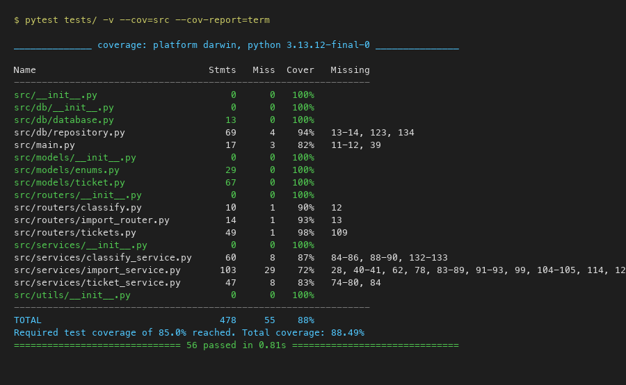

# 🧪 Test Coverage Report

**Date**: 2026-05-08
**Python**: 3.13.12
**pytest**: 9.0.3
**Coverage Tool**: pytest-cov 7.1.0

---

## Summary

| Metric | Value |
|--------|-------|
| **Total Tests** | 56 |
| **Tests Passed** | 56 |
| **Tests Failed** | 0 |
| **Total Statements** | 478 |
| **Statements Missed** | 55 |
| **Overall Coverage** | **88.49%** ✅ |
| **Required Coverage** | 85% |
| **Duration** | 1.30s |

---

## Coverage by Module

| Module | Statements | Missed | Coverage | Missing Lines |
|--------|-----------|--------|----------|---------------|
| `src/__init__.py` | 0 | 0 | 100% | — |
| `src/db/__init__.py` | 0 | 0 | 100% | — |
| `src/db/database.py` | 13 | 0 | **100%** | — |
| `src/db/repository.py` | 69 | 4 | **94%** | 13-14, 123, 134 |
| `src/main.py` | 17 | 3 | 82% | 11-12, 39 |
| `src/models/__init__.py` | 0 | 0 | 100% | — |
| `src/models/enums.py` | 29 | 0 | **100%** | — |
| `src/models/ticket.py` | 67 | 0 | **100%** | — |
| `src/routers/__init__.py` | 0 | 0 | 100% | — |
| `src/routers/classify.py` | 10 | 1 | **90%** | 12 |
| `src/routers/import_router.py` | 14 | 1 | **93%** | 13 |
| `src/routers/tickets.py` | 49 | 1 | **98%** | 109 |
| `src/services/__init__.py` | 0 | 0 | 100% | — |
| `src/services/classify_service.py` | 60 | 8 | **87%** | 84-86, 88-90, 132-133 |
| `src/services/import_service.py` | 103 | 29 | 72% | 28, 40-41, 62, 78, 83-89, 91-93, 99, 104-105, 114, 122, 152, 161, 170, 176-181 |
| `src/services/ticket_service.py` | 47 | 8 | 83% | 74-80, 84 |
| `src/utils/__init__.py` | 0 | 0 | 100% | — |
| **TOTAL** | **478** | **55** | **88%** | — |

---

## Coverage by Layer

| Layer | Modules | Avg Coverage |
|-------|---------|-------------|
| **Models** | enums.py, ticket.py | 100% |
| **Database** | database.py, repository.py | 97% |
| **Routers** | tickets.py, import_router.py, classify.py | 94% |
| **Services** | ticket_service.py, import_service.py, classify_service.py | 81% |

---

## Test File Breakdown

| Test File | Tests | Category | Scope |
|-----------|-------|----------|-------|
| `test_ticket_api.py` | 11 | API | CRUD endpoints (create, get, list, update, delete, validation, 404) |
| `test_ticket_model.py` | 9 | Unit | Pydantic validation (email, lengths, enums, tags, metadata) |
| `test_import_csv.py` | 6 | Import | CSV parsing (valid, missing fields, bad email, extra cols, empty, malformed) |
| `test_import_json.py` | 5 | Import | JSON parsing (valid, invalid fields, empty, malformed, nested metadata) |
| `test_import_xml.py` | 5 | Import | XML parsing (valid, missing elements, invalid values, empty, malformed) |
| `test_categorization.py` | 10 | Classification | All 6 categories, priority escalation, confidence, auto-on-create, manual override |
| `test_integration.py` | 5 | Integration | Ticket lifecycle, import+classify, 25 concurrent creates, combined filters, E2E pipeline |
| `test_performance.py` | 5 | Performance | CRUD <1s, 50-ticket import <5s, classify <1s, 20 concurrent <5s, pagination <1s |
| **Total** | **56** | | |

---

## Test Pyramid

```
        ┌─────────────┐
        │ Integration  │  10 tests (5 integration + 5 performance)
        │  & Perf      │  18% of tests
        ├─────────────┤
        │  Component   │  37 tests (11 API + 6 CSV + 5 JSON + 5 XML + 10 classify)
        │   Tests      │  66% of tests
        ├─────────────┤
        │  Unit Tests  │  9 tests (model validation)
        │              │  16% of tests
        └─────────────┘
```

---

## Uncovered Lines Analysis

### `src/services/import_service.py` (72% — lowest coverage)
- Lines 83-93, 176-181: CSV metadata prefix handling (`metadata_source`, `metadata_browser`, `metadata_device_type` column parsing) — not used in test CSV data which uses flat columns
- Lines 40-41, 104-105: XML `<tags>` and `<metadata>` nested element parsing edge cases
- Lines 28, 62, 114, 122, 152, 161, 170: Various error handling branches for malformed data edge cases

### `src/services/ticket_service.py` (83%)
- Lines 74-80, 84: Metadata flattening in `update_ticket` when metadata dict contains individual fields

### `src/services/classify_service.py` (87%)
- Lines 84-90: Fallback path when no category keywords match (already covered by "other" test, but specific branch missed)
- Lines 132-133: Error logging when ticket not found during auto-classify

---

## How to Reproduce

```bash
cd homework-2
source venv/bin/activate

# Terminal report
pytest --cov=src --cov-report=term

# HTML report (opens in browser)
pytest --cov=src --cov-report=html
open htmlcov/index.html

# Specific module coverage
pytest --cov=src/services --cov-report=term tests/test_categorization.py
```

---

## Screenshot


