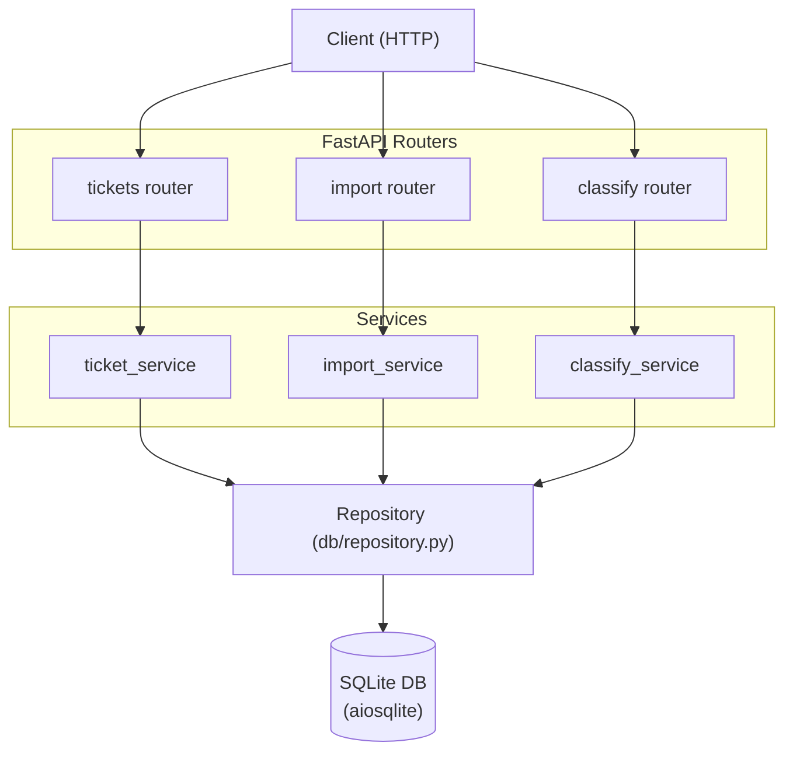

# Intelligent Customer Support System

## Project Overview

REST API for customer support ticket management built with Python and FastAPI. Supports multi-format bulk import (CSV, JSON, XML), automatic ticket classification with confidence scoring, and comprehensive test coverage exceeding 85%.

---

## Features

- **CRUD operations** — create, read, update, and delete support tickets via RESTful endpoints
- **Bulk import** — ingest tickets from CSV, JSON, and XML files in a single request
- **Auto-classification** — assign category and priority labels with confidence scores automatically
- **Pagination and filtering** — query tickets by status, category, priority, and date range
- **>85% test coverage** — unit, integration, and performance test suites with pytest

---

## Architecture Diagram



---

## Tech Stack

| Component | Technology |
|---|---|
| Language | Python 3.11+ |
| Web framework | FastAPI |
| Schema validation | Pydantic v2 |
| Database | SQLite via aiosqlite |
| Testing | pytest, pytest-cov, pytest-asyncio |
| XML parsing | defusedxml |

---

## Installation & Setup

```bash
cd homework-2
python -m venv venv
source venv/bin/activate
pip install -r requirements.txt
pip install -r requirements-dev.txt
```

---

## Running the Server

```bash
uvicorn src.main:app --reload --port 8000
```

Interactive API docs are available at `http://localhost:8000/docs` once the server is running.

---

## How to Run Tests

```bash
# Run all tests
pytest

# Run with coverage report (HTML + terminal summary)
pytest --cov=src --cov-report=html --cov-report=term
```

The HTML coverage report is written to `htmlcov/index.html`.

---

## Project Structure

```
homework-2/
├── src/
│   ├── main.py                  # FastAPI application entry point
│   ├── models/
│   │   ├── ticket.py            # Ticket Pydantic models and schemas
│   │   └── enums.py             # Status, category, and priority enums
│   ├── routers/
│   │   ├── tickets.py           # CRUD endpoints
│   │   ├── import_router.py     # Bulk import endpoints
│   │   └── classify.py          # Classification endpoints
│   ├── services/
│   │   ├── ticket_service.py    # Ticket business logic
│   │   ├── import_service.py    # CSV/JSON/XML parsing and ingestion
│   │   └── classify_service.py  # Auto-classification logic
│   ├── db/
│   │   ├── database.py          # Database connection and init
│   │   └── repository.py        # Data access layer
│   └── utils/
└── tests/
    ├── conftest.py              # Shared fixtures and async test setup
    ├── fixtures/
    │   ├── sample_tickets.csv
    │   ├── sample_tickets.json
    │   ├── sample_tickets.xml
    │   ├── invalid_tickets.csv
    │   ├── invalid_tickets.json
    │   └── invalid_tickets.xml
    ├── test_ticket_api.py       # Endpoint integration tests
    ├── test_ticket_model.py     # Model validation unit tests
    ├── test_import_csv.py       # CSV import tests
    ├── test_import_json.py      # JSON import tests
    ├── test_import_xml.py       # XML import tests
    ├── test_categorization.py   # Classification tests
    ├── test_performance.py      # Load and performance tests
    └── test_integration.py      # End-to-end workflow tests
```
