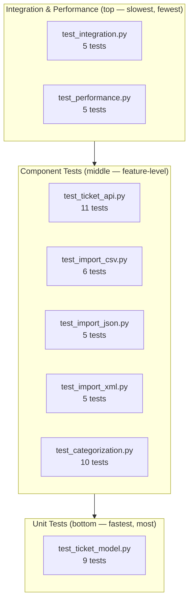

# Testing Guide

> **Audience:** QA Engineers
> **Project:** Support Ticket Management API (Homework 2)
> **Last Updated:** 2026-05-08

---

## Table of Contents

1. [Test Pyramid](#1-test-pyramid)
2. [How to Run Tests](#2-how-to-run-tests)
3. [Test File Summary](#3-test-file-summary)
4. [Sample Test Data Locations](#4-sample-test-data-locations)
5. [Manual Testing Checklist](#5-manual-testing-checklist)
6. [Performance Benchmarks](#6-performance-benchmarks)

---

## 1. Test Pyramid

The suite is organized into three layers following the classic test pyramid: many fast unit tests at the base, a broader set of component/integration tests in the middle, and a small number of high-level integration and performance tests at the top.



**Total: 56 tests across 8 files.**

| Layer | Tests | % of Suite |
|-------|------:|----------:|
| Unit | 9 | 16 % |
| Component | 37 | 66 % |
| Integration / Performance | 10 | 18 % |

---

## 2. How to Run Tests

All commands should be run from the `homework-2/` project root.

```bash
# ── Run the full test suite ──────────────────────────────────────────────────
pytest

# ── Run with coverage report (HTML + terminal summary) ──────────────────────
pytest --cov=src --cov-report=html --cov-report=term

# Open the HTML report afterwards:
#   open htmlcov/index.html   (macOS)
#   xdg-open htmlcov/index.html  (Linux)

# ── Run a specific test file (verbose output) ────────────────────────────────
pytest tests/test_ticket_api.py -v

# ── Run a single named test ───────────────────────────────────────────────────
pytest tests/test_ticket_api.py::test_create_ticket_valid -v

# ── Run only unit tests ───────────────────────────────────────────────────────
pytest tests/test_ticket_model.py -v

# ── Run only integration and performance tests ────────────────────────────────
pytest tests/test_integration.py tests/test_performance.py -v

# ── Stop immediately on first failure ────────────────────────────────────────
pytest -x

# ── Show local variable values on failure ────────────────────────────────────
pytest -l

# ── Run tests matching a keyword expression ───────────────────────────────────
pytest -k "csv or json" -v
```

> **Prerequisites:** Activate the virtual environment and install dev dependencies first.
>
> ```bash
> python -m venv .venv && source .venv/bin/activate
> pip install -r requirements-dev.txt
> ```

---

## 3. Test File Summary

| File | Tests | Category | What It Covers |
|------|------:|----------|----------------|
| `test_ticket_api.py` | 11 | API | CRUD REST endpoints (create, read, update, delete, list, filter) |
| `test_ticket_model.py` | 9 | Unit | Pydantic model validation, field constraints, default values |
| `test_import_csv.py` | 6 | Import | CSV parsing, header validation, malformed-row handling |
| `test_import_json.py` | 5 | Import | JSON structure parsing, schema validation, error cases |
| `test_import_xml.py` | 5 | Import | XML element parsing, namespace handling, invalid XML |
| `test_categorization.py` | 10 | Classification | Auto-classification logic, priority assignment, edge-case keywords |
| `test_integration.py` | 5 | Integration | End-to-end workflows (import → categorize → query → update) |
| `test_performance.py` | 5 | Performance | Throughput benchmarks for bulk import and concurrent requests |
| **Total** | **56** | | |

---

## 4. Sample Test Data Locations

All fixture files live under `tests/fixtures/`.

| File | Format | Records | Description |
|------|--------|--------:|-------------|
| `sample_tickets.csv` | CSV | 50 | Well-formed tickets covering all categories and priority levels; used for happy-path import tests |
| `invalid_tickets.csv` | CSV | 5 | Rows with missing required fields, bad email formats, and malformed tag arrays; used for error-handling tests |
| `sample_tickets.json` | JSON | 20 | Valid JSON array of ticket objects with full field coverage |
| `invalid_tickets.json` | JSON | 3 | JSON objects with structural violations (null IDs, wrong types) |
| `sample_tickets.xml` | XML | 30 | Valid XML document (`<tickets>` root) with diverse ticket children |
| `invalid_tickets.xml` | XML | 3 | XML with missing mandatory elements and malformed date fields |

> All fixture files use the same field schema as the live API so tests reflect real-world payloads.

---

## 5. Manual Testing Checklist

Start the API server before running any cURL steps:

```bash
uvicorn src.main:app --reload --port 8000
# API docs available at http://127.0.0.1:8000/docs
```

### Step-by-step checklist

1. **Health check — confirm the server is up**

   ```bash
   curl -s http://127.0.0.1:8000/health | python3 -m json.tool
   ```

   Expected: `{"status": "ok"}` with HTTP 200.

2. **Create a ticket (POST)**

   ```bash
   curl -s -X POST http://127.0.0.1:8000/tickets \
     -H "Content-Type: application/json" \
     -d '{
       "customer_id": "CUST-001",
       "customer_email": "alice@example.com",
       "customer_name": "Alice Example",
       "subject": "Cannot log in",
       "description": "Invalid password error after reset.",
       "priority": "urgent"
     }' | python3 -m json.tool
   ```

   Expected: HTTP 201, response body contains a generated `id` field.

3. **Retrieve a ticket (GET)**

   ```bash
   # Replace <ID> with the id returned in step 2
   curl -s http://127.0.0.1:8000/tickets/<ID> | python3 -m json.tool
   ```

   Expected: HTTP 200, full ticket object.

4. **List all tickets (GET)**

   ```bash
   curl -s http://127.0.0.1:8000/tickets | python3 -m json.tool
   ```

   Expected: HTTP 200, JSON array containing at least the ticket from step 2.

5. **Filter tickets by priority (GET)**

   ```bash
   curl -s "http://127.0.0.1:8000/tickets?priority=urgent" | python3 -m json.tool
   ```

   Expected: HTTP 200, only tickets with `priority = "urgent"` in the array.

6. **Update a ticket (PUT/PATCH)**

   ```bash
   curl -s -X PATCH http://127.0.0.1:8000/tickets/<ID> \
     -H "Content-Type: application/json" \
     -d '{"priority": "high"}' | python3 -m json.tool
   ```

   Expected: HTTP 200, updated ticket with `"priority": "high"`.

7. **Import tickets from CSV (POST)**

   ```bash
   curl -s -X POST http://127.0.0.1:8000/import/csv \
     -F "file=@tests/fixtures/sample_tickets.csv" | python3 -m json.tool
   ```

   Expected: HTTP 200, summary object showing imported count (50) and 0 errors.

8. **Import tickets from JSON (POST)**

   ```bash
   curl -s -X POST http://127.0.0.1:8000/import/json \
     -H "Content-Type: application/json" \
     --data-binary @tests/fixtures/sample_tickets.json | python3 -m json.tool
   ```

   Expected: HTTP 200, summary showing 20 records imported.

9. **Import invalid CSV and verify error handling**

   ```bash
   curl -s -X POST http://127.0.0.1:8000/import/csv \
     -F "file=@tests/fixtures/invalid_tickets.csv" | python3 -m json.tool
   ```

   Expected: HTTP 200 with partial success or HTTP 422, with error details listing each rejected row.

10. **Trigger auto-categorization (POST)**

    ```bash
    curl -s -X POST http://127.0.0.1:8000/tickets/<ID>/categorize | python3 -m json.tool
    ```

    Expected: HTTP 200, ticket updated with a `category` field inferred from the subject/description.

11. **Delete a ticket (DELETE)**

    ```bash
    curl -s -X DELETE http://127.0.0.1:8000/tickets/<ID>
    ```

    Expected: HTTP 204 No Content.

12. **Confirm deletion (GET)**

    ```bash
    curl -s -o /dev/null -w "%{http_code}" http://127.0.0.1:8000/tickets/<ID>
    ```

    Expected: `404`.

---

## 6. Performance Benchmarks

The `test_performance.py` suite enforces the following targets. Run it explicitly to avoid slowing the default `pytest` run:

```bash
pytest tests/test_performance.py -v --tb=short
```

| Benchmark | Target | Measured |
|-----------|--------|----------|
| Single CRUD operation (create + read) | < 1 s | TBD |
| 50-ticket bulk CSV import | < 5 s | TBD |
| Auto-classification of one ticket | < 1 s | TBD |
| 20 concurrent API requests | < 5 s | TBD |
| Full dataset list query (100+ records) | < 2 s | TBD |

> **Note:** "Measured" values will be filled in after the first full benchmark run against the production-equivalent environment. Update this table after each significant refactor or dependency upgrade.
