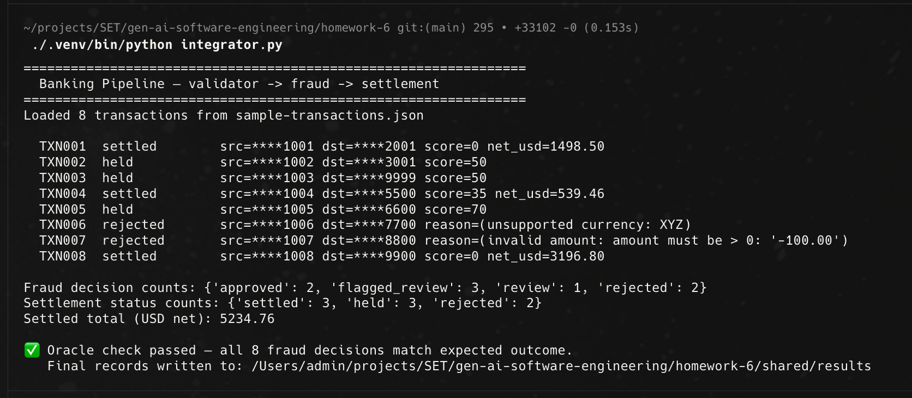
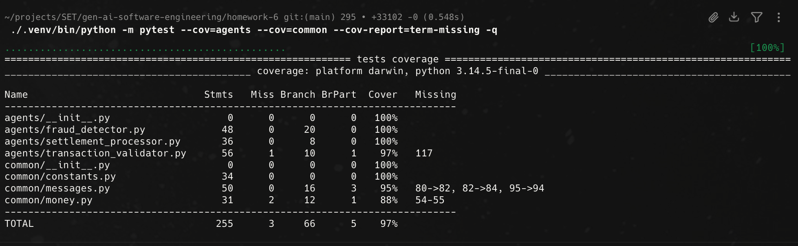
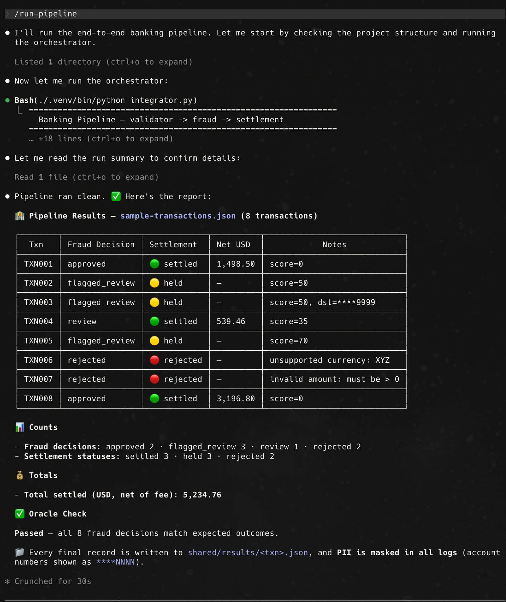
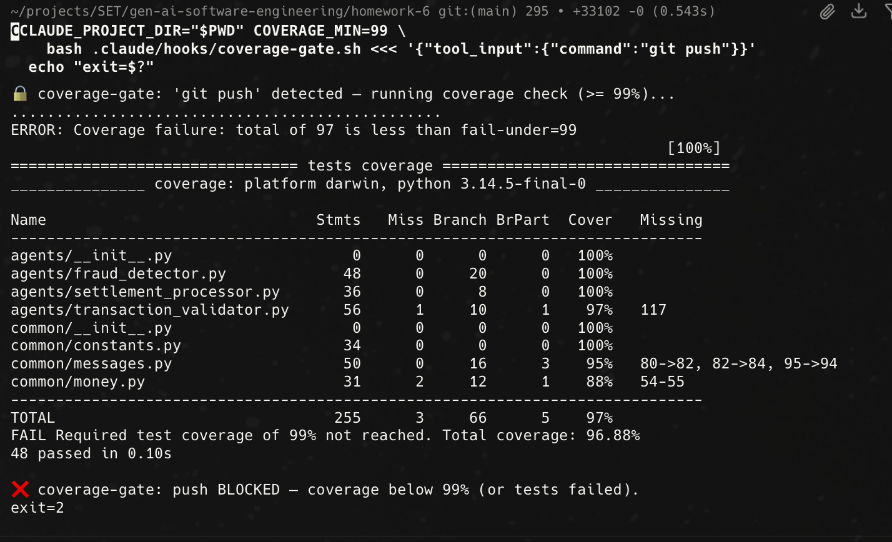
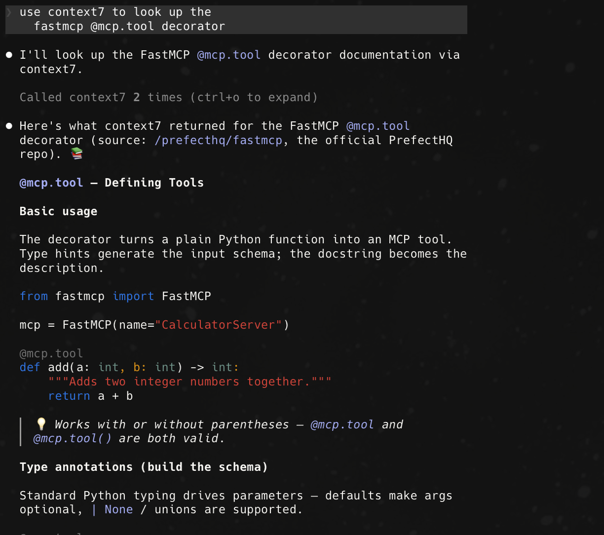
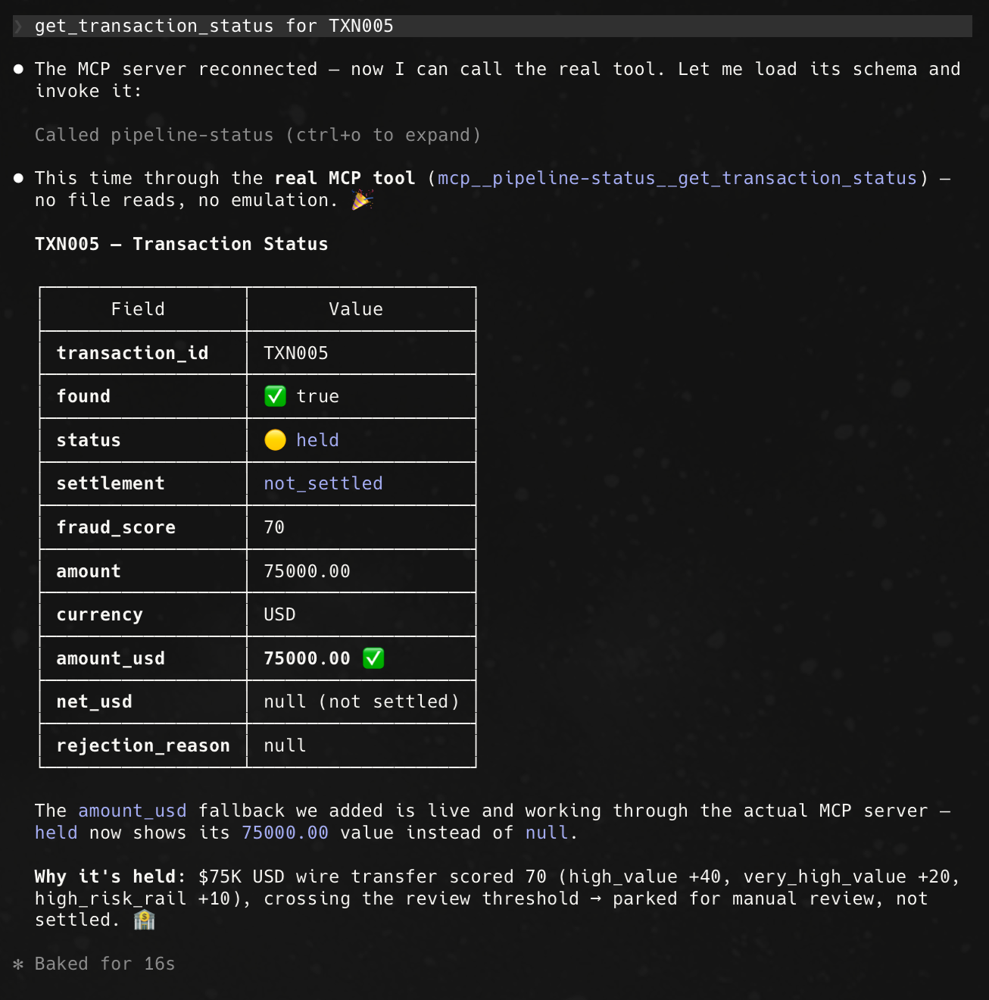

# Homework 6 — AI-Powered Multi-Agent Banking Pipeline

**Created by Vladyslav Shut**

Final capstone: four meta-agents (spec, code, tests, docs) that build a deterministic,
multi-agent **banking transaction pipeline**. Transactions flow through
**validation → fraud scoring → settlement** over a file-based `shared/` protocol,
producing an auditable record per transaction. A custom **FastMCP** server makes the
results queryable, and a **coverage gate** blocks pushes below 80%.

---

## What's in this PR

| Area | Deliverables |
|---|---|
| **Spec (Agent 1)** | `specification.md`, `agents.md`, `/write-spec` skill |
| **Pipeline (Agent 2)** | `integrator.py`, `agents/{transaction_validator,fraud_detector,settlement_processor}.py`, `common/` contracts |
| **Skills & hooks (Agent 3)** | `/run-pipeline`, `/validate-transactions`, coverage-gate hook + `.githooks/pre-push` |
| **MCP (Task 4)** | `mcp.json` (context7 + pipeline-status), `mcp_server/server.py`, `research-notes.md` |
| **Tests & docs (Agent 4)** | `tests/` (48 tests, 97% coverage), `README.md`, `HOWTORUN.md` |

### The three runtime agents
- **Transaction Validator** — required fields, `Decimal > 0` (≤ 2 dp), ISO-4217 currency; rejects with a reason.
- **Fraud Detector** — additive scoring (high value, structuring, unusual timing, cross-border, high-risk rail) → `approved` / `review` / `flagged_review`.
- **Settlement Processor** — FX → USD base + 0.1% fee (ROUND_HALF_UP, min $0.01); `settled` / `held` / `rejected`.

All money uses `decimal.Decimal` (no floats); PII (account numbers) is masked to last-4 in every log.

---

## Outcome oracle (8 sample transactions)

| Decision | Transactions | After settlement |
|---|---|---|
| `approved` | TXN001, TXN008 | `settled` |
| `review` | TXN004 | `settled` |
| `flagged_review` | TXN002, TXN003, TXN005 | `held` |
| `rejected` | TXN006 (currency `XYZ`), TXN007 (negative amount) | `rejected` |

The pipeline asserts this oracle on every run — **all 8 decisions match**.

---

## 🛠️ AI tools used

- **Claude Code (Opus 4.8)** drove the whole build as four meta-agents: spec → code → tests → docs.
  - **Spec** authored via the `/write-spec` skill from the frozen contracts in `TASKS.md`.
  - **Code** generated agent-by-agent (validator, then fraud, then settlement, then integrator), testing each before moving on.
  - **Tests** generated to target ≥ 90% coverage, then verified by actually running `pytest --cov`.
  - **Docs** (`README.md`, `HOWTORUN.md`) generated last, once behavior was locked.
- **context7 MCP** — looked up live docs for the `decimal` module (`/python/cpython`) and `fastmcp` (`/prefecthq/fastmcp`); both queries and the patterns applied are documented in `research-notes.md`.
- **Custom `pipeline-status` MCP server** — built to make results queryable (`get_transaction_status`, `list_pipeline_results`, `pipeline://summary`).
- **What I verified myself (not taken on trust from the model):** ran `integrator.py` and confirmed the oracle passes; ran the full test suite and confirmed 97% coverage; manually triggered the coverage-gate hook and confirmed it blocks a push (exit 2); called the custom MCP tool and confirmed `TXN005 → held`.

## ⚠️ Challenges encountered

- **Float drift in money math** — naive arithmetic produced rounding errors. Resolved by using `decimal.Decimal` end-to-end with `ROUND_HALF_UP` (serialized as strings across the file protocol to preserve precision).
- **`mcp` package name clash** — naming the server package `mcp` shadowed the official MCP SDK that `fastmcp` imports and broke `from fastmcp import FastMCP`. Renamed the package to `mcp_server` (documented in the server docstring).
- **Coverage gate that actually blocks** — needed the hook to fail the push, not just warn. Implemented as a Claude Code PreToolUse hook returning exit code 2, with a `.githooks/pre-push` fallback, and demoed the block by temporarily raising the threshold to 99%.
- **Test isolation** — tests originally touched the real `shared/`. Reworked the integrator to accept a `shared_root` so the integration tests run entirely under `tmp_path`.

---

## Screenshots

### 1. Pipeline run (`python integrator.py`)
All 8 transactions processed, PII masked, oracle check passed.



### 2. Test coverage (gate ≥ 80%, target ≥ 90%)
48 tests passing at **97%** coverage.



### 3. `/run-pipeline` skill
The slash-command skill runs the end-to-end pipeline and reports the per-transaction table + oracle confirmation.



### 4. Coverage-gate hook firing (push blocked)
The PreToolUse coverage gate detects `git push`, runs the suite, and **blocks** when coverage is below threshold (exit 2).



### 5. MCP usage — context7 query
context7 looked up the FastMCP `@mcp.tool` decorator pattern used in `mcp_server/server.py` (documented in `research-notes.md`).



### 6. MCP usage — custom tool call
The custom `pipeline-status` MCP server answering `get_transaction_status("TXN005")` → `held`.



---

## How to verify locally

```bash
# 1. Run the pipeline (asserts the oracle)
./.venv/bin/python integrator.py

# 2. Tests + coverage
./.venv/bin/python -m pytest --cov=agents --cov=common --cov-report=term-missing

# 3. See the coverage gate block a push
CLAUDE_PROJECT_DIR="$PWD" COVERAGE_MIN=99 \
  bash .claude/hooks/coverage-gate.sh <<< '{"tool_input":{"command":"git push"}}'
```

See **HOWTORUN.md** for the full numbered setup → demo, including the MCP server.

---

## Deliverables checklist

- [x] `specification.md` (5 sections + low-level task per agent)
- [x] `agents.md` updated with project context
- [x] `/write-spec` skill generates the spec from the template
- [x] Integrator + 3 cooperating agents, file-based JSON protocol
- [x] `research-notes.md` (2 context7 queries: `/python/cpython`, `/prefecthq/fastmcp`)
- [x] `/run-pipeline` and `/validate-transactions` skills
- [x] Coverage-gate hook blocks push < 80% (+ `.githooks/pre-push` fallback)
- [x] `mcp.json` with context7 + custom `pipeline-status`; `mcp_server/server.py` (2 tools + 1 resource)
- [x] `tests/` — per-agent unit tests + integration test, isolated via `tmp_path` (97% coverage)
- [x] `README.md` includes **author name** + ASCII pipeline diagram
- [x] `HOWTORUN.md` numbered steps
- [x] 6 screenshots in `docs/screenshots/` and embedded above

🤖 Generated with [Claude Code](https://claude.com/claude-code)
